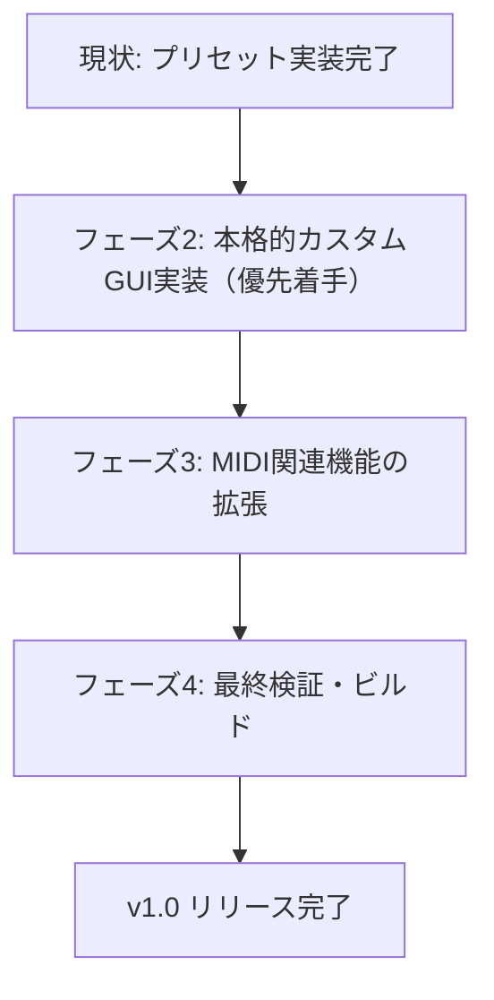

# prop-5 今後の開発・工程プラン（ロードマップ）

本ドキュメントは、VSTiシンセサイザープラグイン「prop-5」のプリセット実装完了（フェーズ1）を受けて、次フェーズである「本格的なGUI実装」および「MIDI機能関連」の開発工程プランをまとめたものです。

---

## 1. 現状の進捗状況と実績
現在までに、以下の基盤機能が実装・検証済みです。
* **DSP / シンセ音源エンジン**: 5ボイス・ポリフォニック仕様。OSC A/B、VCF、VCA、ENV A/B、LFO、Poly Mod、OSC B Lo Mode など、実機準拠の変調ロジックが安定動作中。
* **状態保存 & プリセット管理**: APVTSを利用したXMLによる状態の保存・復元、および13種類のファクトリープリセット（Init Patch含む）の実装・切り替え機構が正常動作中。
* **基本UI配置**: アルペジエーター関連コードをクリーンアップし、画面サイズ `1100 x 440` にパラメータが整理・配置された状態（JUCEデフォルト描画）。

---

## 2. 開発における基本方針（ユーザー合意済み）
対話を通して、以下の設計方針および優先順位が決定されました。
1. **GUIビジュアルアプローチ**: **JUCEの2Dグラフィックスによる完全コード描画**
   * ベクトル描画を採用することで、高解像度（HiDPI/Retina）環境でもボヤけずにクッキリ表示され、拡大縮小に強い軽量なUIを構築します。画像アセットは使用しません。
2. **MIDI制御の仕様**: **固定MIDI CCマッピング + MIDI Learn**
   * 標準的なCCアサイン（74=Cutoffなど）をプリセットしつつ、UI上の右クリックメニュー等から外部MIDIコントローラーのノブと動的に紐付け（MIDI Learn）できる実用的なシステムを構築します。
3. **開発優先順位**: **本格的なGUI構築（フェーズ2）を優先**
   * まず見た目とノブ操作、ダブルクリックでのデフォルト復元などの操作系（UI/UX）を先に完成させ、その後にMIDI機能拡張（フェーズ3）へと進みます。

---

## 3. 今後の工程ロードマップ

### ■ フェーズ2：本格的カスタムGUI実装（最優先）
JUCE標準の簡易的なUIから、Sequential Circuits「Prophet-5」を彷彿とさせるビンテージ感溢れるプレミアムなデザインへとアップデートします。

1. **カスタム LookAndFeel (PropLookAndFeel) の作成**
   * **ビンテージ・ロータリーノブ**: Prophet-5 特有の、側面がギザギザした中央シルバーインサート付きの黒いポインターノブを2Dグラフィックスで美しく描画。
   * **LED風ボタンスイッチ**: アクティブ時に赤く点灯するクラシックな四角いプッシュスイッチを再現。
   * **ヴィンテージ・フォントの適用**: ラベル文字に実機をイメージしたレトロで視認性の高いサンセリフフォントを設定。
2. **コントロールパネルの背景・装飾の洗練**
   * 艶消しブラック／ダークブラウン（`#1A1410`）のメイン金属パネルに、木目調（ウッドフレーム）のサイドウッドパネルを描画し、ハードウェア感を演出。
   * セクションを明確に区分する白線と赤線（実機のストライプ）の描画。
3. **ユーザー体験 (UX) の向上**
   * 各ノブをダブルクリックした際に、定義されたデフォルト値（Init値）にスムーズに戻るリセット処理の実装。
   * ノブを右クリックした際に、数値を直接キーボード入力できるポップアップバルーン/ダイアログの表示。
4. **ウインドウスケーリング対応**
   * ウィンドウ端のドラッグによるプラグイン画面の拡大縮小（スケーリング）に対応。

---

### ■ フェーズ3：MIDI関連機能の拡張
DAW上での楽器としての表現力や、外部MIDIコントローラーとの連携力を大幅に強化します。

1. **MIDI CC (Control Change) マッピング**
   * 主要なシンセパラメータ（Cutoff, Resonance, ENV A/B 各タイム等）を、標準的なMIDI CC（例: Cutoff=74, Resonance=71 等）で外部から動かせるようにマッピング。
2. **MIDI Learn（CC動的アサイン）機能**
   * ユーザーがノブを右クリックして「MIDI Learn」を選択し、手元のハードウェアコントローラーを動かすだけで、そのパラメータとMIDI CCを自動的に紐付けられるようにする。
3. **ベロシティ & アフタータッチ（プレッシャー）の対応**
   * 打鍵強度（Velocity）に応じて VCA（音量）や VCF（カットオフエンベロープ量）をコントロールできるようにする感度調整（Velocity Sensitivity）の追加。
   * 鍵盤の押し込み圧（Aftertouch）で、LFOモジュレーション深度やフィルターを開くなどの表情付けができる機能。
4. **ホイールコントローラーの処理統合**
   * モジュレーションホイール（MIDI CC #1）でのLFO変調深度のリアルタイム制御。
   * ピッチベンド（Pitch Bend）による、設定された半音レンジでのピッチシフト。

---

### ■ フェーズ4：最終検証とビルド
1. **DAWスキャン & オートメーション動作テスト**
   * 主要DAWでのプラグインスキャンがエラーなく通るか。
   * DAWのトラック上でのオートメーション描画によるパラメータ追従性、及びプリセット保存（DAWプロジェクトファイル保存・復元）の挙動検証。
2. **ビルド最適化**
   * リリースビルド（最適化オプション付き）でコンパイルし、5声ポリフォニック時のCPU負荷が十分低く実用レベルに収まっていることをプロファイリング。
   * メモリリーク（Leak Detector）の発生がないことを検証。
